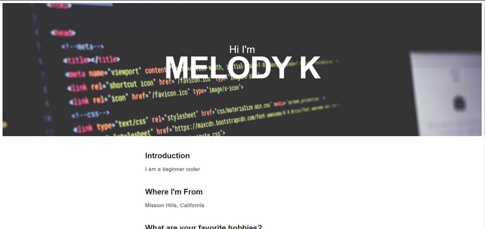

# Prework About Me 
## Description
This website is a static HTML website using semantic tags and minimal CSS. 

## Table of Contents
* [Installation](#installation)
* [Technologies-Libraries](#technologies-libraries)
* [Screenshot](#screenshot)
* [Credits](#credits)

## Installation
In your terminal type:
```git clone https://verlitas.github.io/prework-about-me/```
* Open in Visual Studio to build and run.
* For further instructions, visit https://help.github.com.

## Technologies-Libraries
CSS - HTML

## Screenshot


## Credits
[UABootCamp](https://bootcamp.ce.arizona.edu/coding/)
